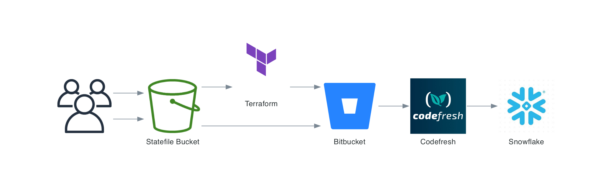

# terraform-snowflake-administrative-policies
Terraform Module for Managing Snowflake Administrative Policies like MFA, Network Policies, and Password Policies

This Terraform module is designed to manage various Snowflake account parameters and resources. Here's an overview of what each resource does:

1. `snowflake_email_notification_integration`: This resource manages an email notification integration in Snowflake. The integration is named "notification" and is enabled to send notifications to the email address "john.doe@gmail.com".
2. `snowflake_account_parameter`: This resource manages various account parameters in Snowflake. The parameters include:

- `ALLOW_CLIENT_MFA_CACHING`
- `ALLOW_ID_TOKEN`
- `ALLOW_EXTERNAL_OAUTH_TOKENS`
- `ALLOW_INSECURE_CONNECTIONS`
- `LOG_LEVEL`
- `TRACE_LEVEL`
- `CLIENT_MEMORY_LIMIT`
- `CLIENT_SESSION_KEEP_ALIVE`

Each of these parameters is set to a value provided through a variable (e.g., `var.allow_client_mfa_caching`, `var.allow_id_token`, etc.).

To use this module, you would need to provide values for these variables when calling the module from your Terraform configuration.
The module will then use these values to set the corresponding account parameters in Snowflake.

Example CICD with `BitBucket` and `Codefresh`:



## Notes

## Usage

To use this Terraform module, you would need to call it from another Terraform configuration file. Here's an example of how you might do that:

```hcl
module "my_module" {
  source = "git::https://github.com/Richard-Barrett/terraform-snowflake-administrative-policies.git?ref=0.0.1"

  allow_client_mfa_caching       = "true"
  allow_external_oauth_tokens    = "true"
  allow_id_token                 = "true"
  client_memory_limit            = "500"
  client_session_keep_alive      = "1100"
  log_level                      = "ERROR"
  trace_level                    = "ALWAYS"
}
```

### Considerations

Here are some considerations when using this Terraform module:

1. `Provider Versions`: Ensure you have the correct versions of the hashicorp/null and Snowflake-Labs/snowflake providers installed. This module requires specific versions of these providers.
2. `Variable Values`: You need to provide appropriate values for all the variables used in this module. These values will be used to set the Snowflake account parameters.
3. `Email Notification Integration`: The email notification integration is set to send notifications to a specific email address. Make sure to replace this with the desired email address.
4. `Permissions`: Ensure you have the necessary permissions in your Snowflake account to create and manage these resources.
5. `Idempotency`: Terraform is idempotent, meaning running the same configuration multiple times will result in the same state. Ensure your configurations are correct before applying to avoid unwanted changes.
6. `Sensitive Data`: Be careful with sensitive data like email addresses or IP addresses. Consider using Terraform's sensitive variables to protect these values.
7. `Error Handling`: Be prepared to handle errors during the creation or modification of resources. Terraform will provide error messages that can help you troubleshoot.

## Overview

This Terraform module manages Snowflake resources and account parameters, including a network policy, an email notification integration, and various account settings like MFA caching, ID token allowance, log level, and more.

<!-- BEGIN_TF_DOCS -->
## Requirements

| Name | Version |
|------|---------|
| <a name="requirement_terraform"></a> [terraform](#requirement\_terraform) | >= 1.5.6 |
| <a name="requirement_snowflake"></a> [snowflake](#requirement\_snowflake) | ~> 0.90.0 |

## Providers

| Name | Version |
|------|---------|
| <a name="provider_snowflake"></a> [snowflake](#provider\_snowflake) | 0.90.0 |

## Modules

No modules.

## Resources

| Name | Type |
|------|------|
| [snowflake_account_parameter.allow_client_mfa_caching](https://registry.terraform.io/providers/Snowflake-Labs/snowflake/latest/docs/resources/account_parameter) | resource |
| [snowflake_account_parameter.allow_external_oauth_tokens](https://registry.terraform.io/providers/Snowflake-Labs/snowflake/latest/docs/resources/account_parameter) | resource |
| [snowflake_account_parameter.allow_id_token](https://registry.terraform.io/providers/Snowflake-Labs/snowflake/latest/docs/resources/account_parameter) | resource |
| [snowflake_account_parameter.allow_insecure_connections](https://registry.terraform.io/providers/Snowflake-Labs/snowflake/latest/docs/resources/account_parameter) | resource |
| [snowflake_account_parameter.client_memory_limit](https://registry.terraform.io/providers/Snowflake-Labs/snowflake/latest/docs/resources/account_parameter) | resource |
| [snowflake_account_parameter.client_session_keep_alive](https://registry.terraform.io/providers/Snowflake-Labs/snowflake/latest/docs/resources/account_parameter) | resource |
| [snowflake_account_parameter.log_level](https://registry.terraform.io/providers/Snowflake-Labs/snowflake/latest/docs/resources/account_parameter) | resource |
| [snowflake_account_parameter.trace_level](https://registry.terraform.io/providers/Snowflake-Labs/snowflake/latest/docs/resources/account_parameter) | resource |
| [snowflake_email_notification_integration.email_integration](https://registry.terraform.io/providers/Snowflake-Labs/snowflake/latest/docs/resources/email_notification_integration) | resource |

## Inputs

| Name | Description | Type | Default | Required |
|------|-------------|------|---------|:--------:|
| <a name="input_allow_client_mfa_caching"></a> [allow\_client\_mfa\_caching](#input\_allow\_client\_mfa\_caching) | Allow client MFA caching | `string` | `false` | no |
| <a name="input_allow_external_oauth_tokens"></a> [allow\_external\_oauth\_tokens](#input\_allow\_external\_oauth\_tokens) | Allow external OAuth tokens | `string` | `false` | no |
| <a name="input_allow_id_token"></a> [allow\_id\_token](#input\_allow\_id\_token) | Allow ID token | `string` | n/a | yes |
| <a name="input_allow_insecure_connections"></a> [allow\_insecure\_connections](#input\_allow\_insecure\_connections) | Allow insecure connections | `string` | `false` | no |
| <a name="input_allowed_recipients"></a> [allowed\_recipients](#input\_allowed\_recipients) | 'value' is a list of allowed email addresses for the integration. The list must be in the format ['email1', 'email2', ...]. Default is '[] | `list(string)` | `[]` | no |
| <a name="input_client_memory_limit"></a> [client\_memory\_limit](#input\_client\_memory\_limit) | Client memory limit | `string` | `"1000"` | no |
| <a name="input_client_session_keep_alive"></a> [client\_session\_keep\_alive](#input\_client\_session\_keep\_alive) | Client session keep alive | `string` | `"3600"` | no |
| <a name="input_enabled"></a> [enabled](#input\_enabled) | value is a boolean that enables or disables the integration. Default is 'true' | `bool` | `true` | no |
| <a name="input_log_level"></a> [log\_level](#input\_log\_level) | Log level | `string` | `"INFO"` | no |
| <a name="input_trace_level"></a> [trace\_level](#input\_trace\_level) | Trace level | `string` | `"ON_EVENT"` | no |

## Outputs

No outputs.
<!-- END_TF_DOCS -->
